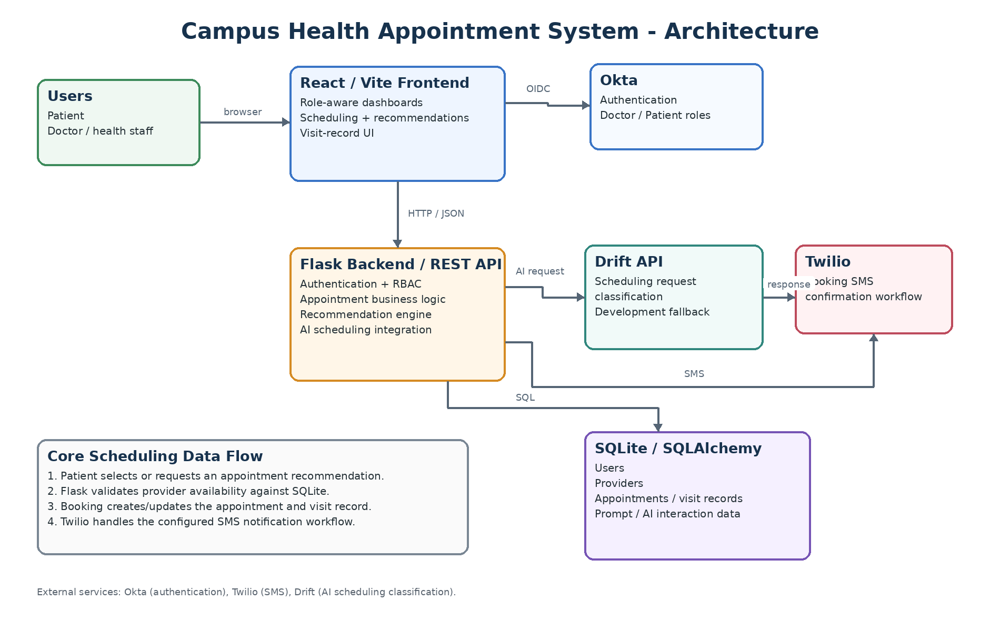

# Campus Health Appointment System

**Name:** Lauren Gilbert  
**Course:** SWENG 861 - Software Construction

## Project Overview

The Campus Health Appointment System is a web application for university students and campus healthcare staff. The original project proposal defined Doctor and Patient role-based access control, appointment-slot viewing, appointment booking and visit records, and SMS appointment confirmations through Twilio as must-have functionality. PCP notification requests and appointment cancellation/rescheduling were identified as nice-to-have features.

The implementation expands on that foundation with separate patient and doctor workflows, structured provider information, appointment recommendations, an AI-assisted Scheduling Assistant, doctor visit-note management, visit completion, and automated backend testing.

## Requirements and Success Criteria

### Original Requirements

The original project proposal defined the following must-have requirements:

1. User authentication and role-based access control with Doctor and Patient roles.
2. View available appointment slots.
3. Book appointments and create visit records.
4. Send appointment confirmation SMS notifications using Twilio.

The proposal also identified these nice-to-have features:

1. Primary Care Provider (PCP) notification request with patient authorization.
2. Cancel and reschedule appointments.

### Success Criteria

The implemented project is considered successful when:

1. Patients can authenticate and access only authorized patient functionality and appointment records.
2. Doctors can authenticate and access doctor-only appointment and visit-record functionality.
3. Patients can view available appointment slots and select an available provider, date, and time.
4. Patients can successfully book appointments and the application prevents duplicate provider/date/time bookings.
5. A successful booking triggers the configured Twilio SMS workflow when a patient phone number is available.
6. Doctors can review visit information, save doctor notes, filter appointments by status, and mark visits completed.
7. Appointment recommendations use actual provider and appointment availability rather than invented appointment slots.
8. The automated backend test suite completes successfully.

## Tech Stack

### Backend

- Python 3
- Flask
- SQLAlchemy
- Flask-Limiter
- SQLite
- Okta OIDC

### Frontend

- React
- Vite
- JavaScript
- HTML / CSS

### External Services

- Okta for authentication
- Twilio for SMS appointment notifications
- Drift API for the AI Scheduling Assistant

### Development Tools

- Git
- GitHub
- Postman
- pytest

## Design and Architecture

The application uses a layered web architecture:

- React/Vite provides the browser user interface.
- Flask provides REST-style backend routes and business logic.
- SQLAlchemy manages persistence to SQLite.
- Okta provides authentication.
- Twilio provides SMS appointment notifications.
- Drift provides the external AI integration for the Scheduling Assistant.
- The recommendation workflow uses structured scheduling preferences together with real provider and appointment availability.

### Architecture Diagram

## Key Implementation Choices

### Authentication and Role-Based Authorization

Okta handles authentication while application user records store the role used by the application. Backend routes enforce Patient and Doctor permissions. React also provides role-aware dashboards and navigation, but frontend visibility is not treated as the security boundary.

### Patient Appointment Access

Patients use a patient-specific appointment list and can access their own appointment details. Doctor-only appointment views are protected separately.

### Doctor Visit-Record Workflow

Doctors have a dedicated dashboard and can:

- View all appointments.
- See patient names for appointments linked to user profiles.
- Filter appointments by status.
- Open visit records.
- Review patient notes.
- Add or update doctor notes.
- Mark visits as completed.

### Appointment Availability

Appointment availability is generated from the scheduling window, provider data, supported appointment times, and existing scheduled appointments. Booked provider/date/time combinations are removed from availability and checked again during booking.

### Provider Data

Provider records are stored in SQLite and include information used by both scheduling and recommendation workflows.

### Recommendation Engine

Patients can request appointment recommendations using a service category and preferred time of day. The recommendation workflow uses provider information and real appointment availability, and booked provider/date/time combinations are excluded.

### AI Scheduling Assistant

The recommendation page also includes a natural-language Scheduling Assistant. The assistant classifies a scheduling request into supported scheduling values. Those values are then sent through the application's normal recommendation workflow, which searches real provider and appointment availability.

The Scheduling Assistant is intended only to assist with appointment classification and scheduling preferences. It does not provide medical diagnoses, treatment recommendations, or medical advice.

### Drift Development Fallback

The application is integrated with the provided Drift API. When the external Drift service is unavailable during development, the backend can use a clearly identified development fallback classifier so the rest of the scheduling workflow can still be tested. The fallback does not create appointment availability.

### Twilio Notification Handling

Twilio is used for appointment SMS notifications. The current Twilio trial environment uses a predefined appointment-reminder template, so the trial message text may contain sample date/time information controlled by Twilio rather than the appointment data stored by the application.

### PCP Notification Request

Patients may request PCP notification and provide PCP contact information during booking. The application displays an authorization notice explaining that selecting the request does not automatically send appointment information and that authorization must be handled through the Campus Health office before information is sent.

## Features

### Patient Appointment Scheduling

- View available appointment slots.
- Select a provider.
- Filter available appointments by month.
- View appointment availability up to 3 months in advance.
- Monday through Friday appointment availability.
- Book appointments.
- View appointment details.
- Prevent duplicate provider/time bookings.
- Cancel appointments.
- Reschedule appointments.

### Patient Profile

- View profile information.
- Store and update a phone number for SMS appointment notifications.

### Doctor Workflow

- Doctor Dashboard.
- View all appointments.
- Display patient names.
- Filter appointments by status.
- Open visit records.
- Review patient notes.
- Add and update doctor notes.
- Mark visits completed.

### Appointment Recommendations

- Select a service category.
- Select a preferred time of day.
- Receive recommendations based on actual provider availability.
- Select a recommendation and continue through the normal booking flow.

### AI-Assisted Scheduling

- Enter a natural-language scheduling request.
- Classify the request into supported scheduling preferences.
- Send the resulting preferences through the standard recommendation engine.
- Continue to a real available appointment and booking flow.

## Testing Strategy and Results

The backend uses pytest for automated testing. The automated suite covers areas including:

- Authentication routes.
- Authentication middleware.
- Patient and Doctor role behavior.
- Appointment ownership and access control.
- Appointment booking validation.
- Duplicate-slot prevention.
- AI development fallback classification.
- Drift client behavior.
- Drift response validation.
- Prompt/API authorization.

### Latest Test Result

The latest completed test run reported:

31 passed, 1 warning

Run the suite from `src/server` with the virtual environment active: python -m pytest -v

### Test Result Screenshot

The remaining Flask-Limiter message in the latest run is a warning rather than a failed test.

## User Workflows

### Patient Workflow

1. Login with Okta.
2. View or update profile information and phone number.
3. Choose manual appointment availability or appointment recommendations.
4. Select an available appointment.
5. Complete the booking form.
6. View booked appointments and appointment details.
7. Cancel or reschedule appointments when appropriate.

### AI-Assisted Patient Workflow

1. Open Find a Recommended Appointment.
2. Select scheduling preferences or describe the requested appointment to the Scheduling Assistant.
3. The scheduling request is classified into supported scheduling values.
4. The recommendation endpoint searches actual provider availability.
5. Select a recommended appointment.
6. Continue to the standard booking page.

### Doctor Workflow

1. Login with a Doctor-role Okta account.
2. Open the Doctor Dashboard.
3. View all appointments.
4. Filter appointments by visit status.
5. Open a visit record.
6. Review patient information and patient notes.
7. Add or update doctor notes.
8. Mark a visit as completed.

## Repository Setup

Clone the repository:

git clone https://github.com/psu-edu/sweng861-capstone-lmg6725.git
cd sweng861-capstone-lmg6725

## How to Run

### Backend

From the repository root: cd src\server

Create a virtual environment if needed: python -m venv venv

Activate it on Windows:  venv\Scripts\activate

Install Python dependencies: python -m pip install -r requirements.txt

Start Flask: python main.py

### Frontend

Open a second terminal:
- cd src\client
- npm install
- npm run dev

## Environment Variables

Create the backend `.env` file required by the project. 

### Backend
OKTA_CLIENT_ID=<Okta client ID>
OKTA_CLIENT_SECRET=<Okta client secret>
OKTA_ISSUER=<Okta issuer>
OKTA_REDIRECT_URL=http://localhost:5000/authorize/callback
FRONTEND_URL=http://localhost:5173
DRIFT_API_KEY=<Drift API key>
TWILIO_ACCOUNT_SID=<Twilio account SID>
TWILIO_AUTH_TOKEN=<Twilio auth token>
TWILIO_PHONE_NUMBER=<Twilio sending phone number>

### Frontend

VITE_BACKEND_URL=http://localhost:5000

## Okta setup
This application uses Okta OpenID Connect (OIDC) for authentication. Users authenticate through Okta, and the application creates or updates local user records after successful login.

1. Create an Okta Application
2. Create or sign in to an Okta Developer account.
3. Create a Web Application integration.
    - Configure the Redirect URI:
4. Copy the following values into the backend .env file:
- OKTA_CLIENT_ID=
- OKTA_CLIENT_SECRET=
- OKTA_ISSUER=

### Test Accounts
Create test users within Okta for application testing. The application supports both Doctor and Patient

## Initial Role Configuration
Authentication is handled by Okta, while application authorization uses Doctor and Patient roles stored within the application database.

After creating or logging in with test accounts, role assignments may need to be updated using the helper scripts located in:

src/server/scripts
Review and execute the appropriate scripts in this directory to update database records and assign Doctor or Patient roles before testing role-protected functionality.

These scripts are used to support the application's role-based access control implementation and Doctor/Patient workflows.

## How to Demo

### Patient Demo

1. Log in with a Patient-role Okta account.
2. Open My Profile and verify or update the phone number.
3. Open View Available Slots.
4. Select a provider and appointment time.
5. Complete the booking form.
6. Show the created appointment and appointment details.
7. Demonstrate cancel/reschedule if needed.
8. Show the SMS notification flow.

### AI-Assisted Demo

1. Open Find Recommended Appointment.
2. Enter a natural-language scheduling request.
3. Submit the request to the Scheduling Assistant.
4. Review the detected service/time preference.
5. Review the recommended available appointments.
6. Select a recommendation.
7. Continue to the normal booking page.

If the external Drift service is unavailable, explain that the page is using the clearly labeled development fallback while appointment recommendations still use application provider and availability data.

### Doctor Demo

1. Log in with a Doctor-role account.
2. Open the Doctor Dashboard.
3. Open All Appointments.
4. Filter appointments by status.
5. Open a visit record.
6. Review the patient's reason and notes.
7. Enter and save Doctor Notes.
8. Mark the visit completed.

## Demo Screenshots

Repository documentation:

1. `docs/patient-dashboard.png` - Patient dashboard showing the available scheduling paths.
2. `docs/available-slots.png` - Available Appointment Slots page with provider/month selection and times.
3. `docs/ai-scheduling.png` - Scheduling Assistant input and recommendation results.
4. `docs/booking.png` - Booking page with the selected provider/date and booking fields.
5. `docs/doctor-dashboard.png` - Doctor Dashboard.
6. `docs/doctor-appointments.png` - Doctor appointment list showing patient names and status filter.
7. `docs/visit-record.png` - Doctor visit record showing patient notes and doctor-note controls. 
8. `docs/test_results.png` - Passing pytest output. You already captured this screenshot.

9. `docs/sms-confirmation.png` - Twilio SMS test message. 

## Known Development Limitations

- The external Drift service may be unavailable. The application currently supports a clearly labeled development fallback for the AI-assisted scheduling workflow.
- Twilio trial messaging uses a predefined appointment-reminder template, so the trial message text may contain sample date/time information controlled by Twilio.
- Older development appointment rows that do not reference an existing user profile may display `Unknown Patient` in the doctor workflow.

## Future Work

Potential future improvements include:

- Production deployment beyond the current local run workflow.
- Production-ready external AI availability and stronger AI observability.
- Production Twilio messaging beyond the trial-template constraints.
- Additional CI/CD automation and deployment packaging.
- Additional metrics and operational dashboards.

## Project Repository

https://github.com/psu-edu/sweng861-capstone-lmg6725
